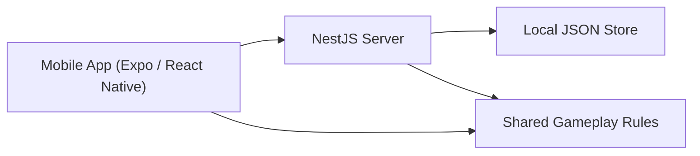

# PixelPet

PixelPet is a retro-styled mobile pet prototype built with `Expo + React Native`, `NestJS`, and a shared gameplay package.

This repository is currently optimized for local development and rapid gameplay iteration, not production deployment. A new developer should be able to read this document and understand:

- what each app/package does
- how the current app flow works
- which gameplay policies are already fixed in code
- which parts are still prototype-only
- how to run and test the project locally


## 1. Project Summary

The current prototype focuses on a single active pet loop:

- sign in with a device-based demo account
- receive one random starter pet
- maintain care stats through timed actions
- grow through passive time-based XP and battle rewards
- enter `critical` and `dead` states if neglected
- revive with limited free tickets or accept the pet's death
- inspect pet species and trait information from the home screen
- test premium-only behavior with a settings toggle
- run local dev battles against a bot

The repository is split into three main parts:

- `apps/mobile`: Expo mobile client
- `apps/server`: NestJS API server
- `packages/shared`: shared types and gameplay rules used by both sides

## 2. Current Scope And Non-Goals

### In Scope

- local demo login
- local JSON persistence
- one active pet per user
- home care loop
- trait system
- level / XP / death / revive loop
- dev premium toggle
- dev battle flow against a bot
- shared tests for gameplay rules

### Out Of Scope For Now

- production auth providers
- production database
- real in-app purchase receipt verification
- finalized multiplayer battle policy
- production security hardening
- deployment / observability setup

## 3. Architecture At A Glance



### Design Principle

Core game rules live in `packages/shared` first, then both mobile and server consume the same logic.

Examples:

- pet templates
- elements
- traits
- care stat deltas
- neglect decay
- progression thresholds
- battle stat generation
- battle turn resolution

This keeps mobile UI and server simulation aligned.

## 4. Repository Layout

### Root

- `package.json`
  Workspace scripts for `dev:mobile`, `dev:server`, `build`, `test`
- `README.md`
  Developer onboarding and current product policy

### Mobile App

- `apps/mobile/App.tsx`
  Main UI shell, tab rendering, home/battle/collection/settings screens
- `apps/mobile/lib/use-app-shell.ts`
  Session restore, login, pet fetch, premium toggle, mutation orchestration
- `apps/mobile/lib/api/`
  Mobile API client split by domain
  - `auth.ts`
  - `pets.ts`
  - `battle.ts`
  - `premium.ts`
  - `client.ts`
- `apps/mobile/lib/auth/`
  AsyncStorage session and install-id helpers
- `apps/mobile/lib/store/`
  Zustand session store
- `apps/mobile/lib/pet-life.ts`
  UI copy for `good / alive / critical / dead`
- `apps/mobile/lib/pet-traits.ts`
  UI copy for trait names and descriptions
- `apps/mobile/components/`
  Pixel UI components like `PetSprite`, `PixelCard`, `PixelIcon`
- `apps/mobile/theme/`
  Theme colors and theme context
- `apps/mobile/assets/`
  fonts, icons, and sprite assets

### Server App

- `apps/server/src/main.ts`
  Nest bootstrap, CORS, JSON middleware, port `3001`
- `apps/server/src/app.module.ts`
  Module composition
- `apps/server/src/auth/`
  Demo login and session creation
- `apps/server/src/pet/`
  Pet retrieval, revive, accept-death, ownership checks
- `apps/server/src/care/`
  Care action endpoint
- `apps/server/src/battle/`
  Battle queue, dev bot battle, battle action handling
- `apps/server/src/premium/`
  Premium status and dev toggle
- `apps/server/src/replay/`
  Premium replay listing
- `apps/server/src/content/`
  Template/content listing
- `apps/server/src/common/`
  Auth guard, sessions, in-memory store facade, local JSON persistence

### Shared Package

- `packages/shared/src/types.ts`
  Core domain types
- `packages/shared/src/content/templates.ts`
  Pet roster definition
- `packages/shared/src/elements.ts`
  Element advantage rules
- `packages/shared/src/traits.ts`
  Trait definitions and trait battle effects
- `packages/shared/src/care.ts`
  Care action deltas, timed care config, neglect decay
- `packages/shared/src/progression.ts`
  XP bands, life-state simulation, revive constants, battle aftermath XP
- `packages/shared/src/battle.ts`
  Battle fighter stat creation and turn resolution

## 5. Current Runtime Flow

### 5.1 App Startup

1. Splash screen
2. Session restore check
3. If stored session is valid, fetch current pet from server
4. If session is missing or invalid, go to login

### 5.2 Login

- current login is `demo` only
- mobile creates or reuses an `installId`
- server uses that `installId` to identify the same demo user
- display name is derived from install id and is not the real identity key

### 5.3 First Pet

- each user can have only one active pet
- first pet is rolled randomly from `PET_TEMPLATES`
- nickname is optional
- initial pet values:
  - `level = 1`
  - `experience = 0`
  - `lifeState = alive`
  - `freeRevivesRemaining = 3`

### 5.4 Main Tabs

- `홈`
  active pet view, care stats, info modal, care actions, death/revive UX
- `배틀`
  current mobile flow uses dev battle against a bot
- `도감`
  preview of shared templates
- `설정`
  profile summary, logout, theme, language, premium dev toggle

## 6. Gameplay Policies

This section reflects the current code, not a future design idea.

### 6.1 Elements

The current prototype defines 5 elements:

- `fire`
- `water`
- `grass`
- `electric`
- `digital`

### 6.2 Pet Roster

The shared template roster currently contains `60` prototype templates:

- 5 elements
- 12 templates per element

Each template includes:

- species name
- motif
- rarity
- base battle stats
- deterministic trait
- flavor text

### 6.3 Traits

Each pet template owns exactly one trait. The trait is derived from template stat bias in shared code, not assigned manually in the mobile app.

Current trait ids:

- `assault`
- `guardian`
- `quickstep`
- `sturdy`
- `finisher`
- `focus`

Trait info is shown in the home screen via the species info modal opened by the `i` button next to species.

### 6.4 Care System

Care actions do not apply instantly anymore.

Current behavior:

- user taps a care button
- a timer starts on the client
- only one care action can run at a time
- other care buttons stay disabled while the timer is running
- the server request is sent only after the timer completes
- if the app goes to background, the running care is cancelled
- if the user changes tabs during care, a confirmation modal appears

#### Care Cancel Modal

If the user tries to leave the home tab during a running care action:

- message: `이동하면 진행중인 {케어명} 가 취소됩니다.`
- buttons:
  - `계속 진행`
  - `취소 후 이동`

#### Care Durations

| Action | Free | Premium |
| --- | ---: | ---: |
| `feed` | 20s | 15s |
| `clean` | 30s | 25s |
| `play` | 45s | 35s |
| `rest` | 60s | 45s |

#### Care Effects

| Action | Effect |
| --- | --- |
| `feed` | `hunger +14`, `mood +2` |
| `clean` | `hygiene +16`, `bond +2` |
| `play` | `mood +12`, `bond +4`, `energy -10` |
| `rest` | `energy +18`, `hunger -6` |

All care values are clamped to `0..100`.

### 6.5 Time Tick And Neglect

`1 tick = 2 hours`

At each tick:

- neglect decay is applied
- if the pet is in `good` state at tick start, it earns `+5 XP`

This keeps the total passive XP gain equal to the previous `4h / +10 XP` plan.

#### Neglect Decay Per Tick

Free users:

- `hunger -3.5`
- `mood -3.5`
- `hygiene -3.5`
- `energy -3`
- `bond -1.5`

Premium users:

- `hunger -2`
- `mood -2`
- `hygiene -2`
- `energy -1.5`
- `bond -0.5`

Internal calculations allow decimals. The mobile UI rounds visible stat numbers to integers.

### 6.6 Life States

The pet can be in one of four states:

- `good`
- `alive`
- `critical`
- `dead`

#### Good

- overall average of all 5 care stats is `>= 75`
- only `good` state earns passive XP

#### Critical

The pet becomes `critical` when either rule is true:

- one core stat is `<= 10`
- average of the 4 core stats is `< 40`

Core stats:

- hunger
- mood
- hygiene
- energy

`bond` is included in `good` average, but not in the critical threshold.

#### Recovering From Critical

To leave `critical`, the pet must satisfy both:

- all 4 core stats are `>= 25`
- average of the 4 core stats is `>= 55`

After that:

- if total 5-stat average is `>= 75`, state becomes `good`
- otherwise state becomes `alive`

#### Dead

- if `critical` continues for `12 hours`, the pet becomes `dead`
- dead pets cannot use care or battle

### 6.7 XP And Level Policy

- max level: `20`
- XP is stored as current-level progress, not total lifetime XP
- when leveling up, required XP is consumed and overflow carries forward

#### XP Requirement By Level Band

| Level Range | Required XP |
| --- | ---: |
| `1 - 4` | `100` |
| `5 - 9` | `160` |
| `10 - 14` | `240` |
| `15 - 20` | `360` |

Home screen policy:

- the EXP bar stays fixed-length
- numeric EXP text is intentionally hidden on the home card
- raw life-state text is also intentionally hidden on the home card

### 6.8 Death, Revive, Restart

Each pet starts with `3` free revives.

#### Revive

If the pet is `dead` and at least one free revive remains:

- `freeRevivesRemaining -= 1`
- `lifeState = alive`
- `criticalSince` and `diedAt` are cleared
- `hunger`, `mood`, `hygiene`, `energy` are restored to `60`
- `bond`, `level`, and `experience` stay as they were

#### Accept Death

If the player does not want to revive:

- the current pet is deleted
- the user returns to the first-pet flow

### 6.9 Battle Policy

Battle is still prototype-grade and the long-term policy is not finalized yet.

Current state:

- server has normal queue and dev queue endpoints
- mobile currently uses `queue-dev`
- dev queue immediately creates a battle against a bot
- battle outcome applies:
  - XP reward
  - care-stat aftermath
  - pet refresh on the mobile client

#### Battle XP

- win: `+20 XP`
- lose: `+8 XP`

#### Battle Aftermath

Winner:

- `hunger -6`
- `hygiene -8`
- `energy -12`
- `mood +6`
- `bond +4`

Loser:

- `hunger -10`
- `hygiene -10`
- `energy -16`
- `mood -8`
- `bond +1`

### 6.10 Premium Policy

Premium is currently a development/testing feature, not a real commerce feature.

Current behavior:

- settings tab contains a premium mode switch
- the switch directly calls the server dev toggle
- no environment flag is required anymore
- `verify-purchase` is intentionally not implemented

Premium currently affects:

- shorter care durations
- replay access
- slower neglect decay

### 6.11 Persistence Policy

This project currently uses local persistence only.

Mobile persists:

- install id
- session token
- session user
- language
- theme

Server persists:

- users
- pets
- sessions
- replays

Server storage file:

- `apps/server/data/store.json`

Notes:

- the file is local and gitignored
- deleting it resets local server-side progress
- tests can override the path with `PIXELPET_STORE_FILE`

## 7. Important UI Decisions

These are current product decisions reflected in code:

- home screen shows EXP bar only, not numeric EXP text
- home screen hides raw life-state text on the main card
- species info is opened by the `i` button next to species
- the first-pet naming modal title is `이름 지어주기`
- the helper text under the name input is intentionally hidden from end users
- premium mode is controlled from the top profile row with an animated switch

## 8. API Summary

### Auth

- `POST /auth/demo`
  create or restore a demo user from `installId`
- `POST /auth/social`
  placeholder route for future provider-based auth

### Pets

- `POST /pets/roll-initial`
- `GET /pets/me`
- `GET /pets/:id`
- `POST /pets/:id/revive`
- `POST /pets/:id/accept-death`
- `POST /pets/:id/care`

### Battle

- `POST /battle/queue`
- `POST /battle/queue-dev`
- `GET /battle/:id`
- `POST /battle/:id/action`
- `GET /battle/replays`

### Content

- `GET /content/characters`

### Premium

- `GET /premium/status`
- `POST /premium/dev/toggle`
- `POST /premium/verify-purchase`  
  currently returns `501 Not Implemented`

## 9. Running The Project

### 9.1 Install

From the repository root:

```bash
npm install
```

### 9.2 Start The Server

```bash
npm run dev:server
```

Server URL:

- `http://localhost:3001`

### 9.3 Start The Mobile App

```bash
npm run dev:mobile
```

Or inside the mobile workspace:

```bash
cd apps/mobile
npx expo start
```

### 9.4 Mobile API Resolution

The mobile client resolves the API target in this order:

1. `EXPO_PUBLIC_API_URL` from `apps/mobile/.env.local`
2. Android emulator default: `http://10.0.2.2:3001`
3. iOS simulator / web default: `http://localhost:3001`

To override:

```bash
cd apps/mobile
copy .env.example .env.local
```

Then set:

```bash
EXPO_PUBLIC_API_URL=http://YOUR_IP:3001
```

### 9.5 Real Device Testing

Use your PC LAN IP:

```bash
EXPO_PUBLIC_API_URL=http://192.168.0.10:3001
```

Make sure the phone and PC are on the same network.

## 10. Build And Test

From the repository root:

```bash
npm run build
npm test
```

Workspace-level commands:

```bash
npm run build --workspace @pixel-pet-arena/shared
npm run test --workspace @pixel-pet-arena/shared
npm run test --workspace @pixel-pet-arena/server
npm run test --workspace @pixel-pet-arena/mobile
```

Current automated coverage includes:

- shared gameplay rules
- server integration flow
- mobile session/storage helpers
- mobile pet life / trait helpers

## 11. Visual And Asset Notes

- the app uses `Mona12` and `Mona12-Bold`
- dark theme is the default, with a light mode toggle in settings
- care buttons use pixel icon assets
- only some species have registered sprite-sheet animation right now
- non-registered species fall back to generated pixel silhouettes by element

## 12. Known Prototype Constraints

- battle policy is not final
- mobile currently uses dev bot battle, not finalized live PvP
- premium is a dev toggle, not real billing
- server persistence is local JSON, not a real DB
- replay access is premium-only in current code
- sprite coverage is partial
- security hardening for multi-user live deployment is not the goal of the current branch

## 13. Recommended Reading Order For New Developers

If you are joining the project, read in this order:

1. `README.md`
2. `packages/shared/src/types.ts`
3. `packages/shared/src/care.ts`
4. `packages/shared/src/progression.ts`
5. `packages/shared/src/traits.ts`
6. `packages/shared/src/battle.ts`
7. `apps/server/src/common/store.service.ts`
8. `apps/server/src/pet/pet.service.ts`
9. `apps/mobile/lib/use-app-shell.ts`
10. `apps/mobile/App.tsx`

This path gives you the domain model first, then the server behavior, then the mobile shell.
