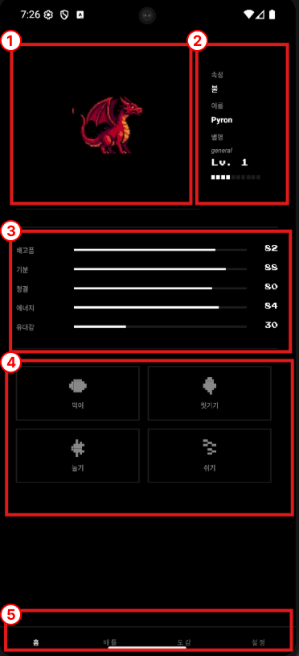
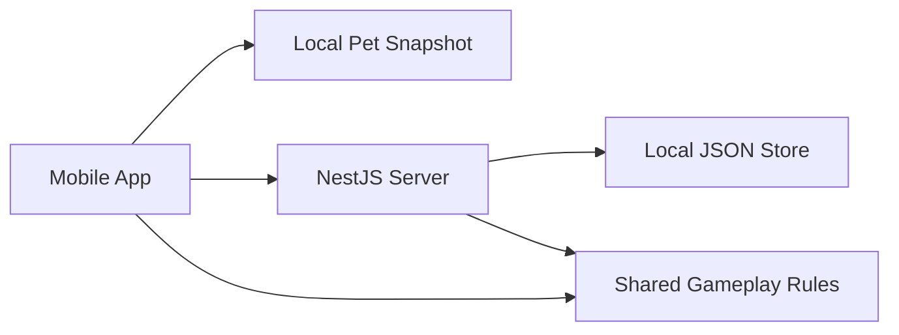

# PixelPet

PixelPet is a retro-styled mobile pet prototype built with `Expo + React Native`, `NestJS`, and a shared gameplay package.

The project is currently optimized for local development and gameplay iteration. The core product direction is:

- pet raising works offline first on the device
- battle is online only
- gameplay rules live in `packages/shared`
- server acts as account/session storage, battle host, and sync target



## 1. What This App Is

The current prototype lets a player:

- sign in with a device-based demo account
- receive one active pet
- raise that pet through timed care actions
- progress through local time simulation, XP, level ups, and stage changes
- enter `critical` and `dead` states if neglected
- revive with limited free tickets or accept the pet's death
- inspect species and trait info from the home screen
- toggle a dev premium mode from settings
- fight an online dev battle against a bot when connected

This is not a production app yet. It is a local-first pet prototype with a server-backed battle/sync layer.

## 2. Repository Layout

```text
.
|- apps/
|  |- mobile/   Expo mobile client
|  \- server/   NestJS API server
|- packages/
|  \- shared/   Shared domain types and gameplay rules
\- README.md
```

### `apps/mobile`

- `App.tsx`
  Main UI shell, tab rendering, modals, and pixel UI composition
- `lib/use-app-shell.ts`
  Session restore, offline pet projection, local care flow, sync orchestration, premium toggle, battle gating
- `lib/offline-pet.ts`
  Local pet snapshot storage, local progression simulation, pending care queue, sync metadata
- `lib/api/`
  Domain-based API client modules
- `lib/auth/`
  AsyncStorage session and install-id helpers
- `components/`
  Pixel UI components including `PetSprite`

### `apps/server`

- `src/auth/`
  Demo login and session creation
- `src/pet/`
  Pet retrieval, revive, accept-death, snapshot sync
- `src/care/`
  Care endpoint used by the legacy server path and online flows
- `src/battle/`
  Dev battle queue, battle creation, turn resolution
- `src/premium/`
  Dev premium status/toggle endpoints
- `src/common/`
  Guard/session handling and local JSON persistence

### `packages/shared`

- `src/types.ts`
  Core domain model
- `src/care.ts`
  Care deltas, care durations, neglect decay
- `src/progression.ts`
  XP bands, tick simulation, life-state transitions, revive constants
- `src/traits.ts`
  Trait definitions and trait battle effects
- `src/forms.ts`
  Level-to-stage helpers and form/stage policies
- `src/battle.ts`
  Battle stat creation and turn resolution
- `src/content/templates.ts`
  Pet template roster

## 3. Architecture



### Source Of Truth

The app now uses a split ownership model:

- pet raising state is local-first on the device
- battle is server-hosted and online only
- server stores the synced pet snapshot and account/session data
- shared gameplay rules are reused on both mobile and server

That means the mobile app can continue raising a pet without a network connection, but battle still requires sync plus connectivity.

## 4. Current Runtime Flow

### App Startup

1. Read stored session
2. Read locally cached pet snapshot
3. If a local pet exists, project it forward locally and enter the app immediately
4. If network is available, try syncing/refetching in the background
5. If there is no stored session, go to demo login

### Login

- auth mode is currently `demo` only
- mobile creates or reuses an `installId`
- server uses `installId` as the stable identity key
- display name is derived from that id and is not the real account key

### First Pet

- one active pet per user
- first pet is rolled from shared templates
- nickname is optional
- initial values:
  - `level = 0`
  - `experience = 0`
  - `lifeState = alive`
  - `freeRevivesRemaining = 3`

### Main Tabs

- `Home`
  Active pet, care stats, species info modal, care actions, revive/death flow, offline/sync state
- `Battle`
  Online-only dev battle flow with connectivity and sync gates
- `Collection`
  Shared template preview
- `Settings`
  Profile summary, premium dev toggle, theme, language, logout

## 5. Offline-First Pet Policy

This is the most important current design decision.

### What Works Offline

- pet state projection
- passive time simulation
- level / XP progression
- `good / alive / critical / dead` transitions
- care completion and stat updates
- revive and accept-death flow
- stage calculation and sprite fallback
- viewing home / collection / settings data that already exists locally

### What Does Not Work Offline

- demo login for a brand new session
- first pet roll if the user has never synced a pet before
- battle queueing and battle turns
- server replay access
- premium state refresh from server

### Local Snapshot Model

The mobile app stores a local pet snapshot with metadata such as:

- pet state
- `revision`
- `primaryDeviceId`
- `lastServerSyncAt`
- pending care queue
- time integrity state

This is intentionally small. The app does not store large replay logs or large local databases.

### Sync Strategy

When the app regains connectivity:

- it syncs the latest local pet snapshot back to the server
- the server validates `deviceId`, `ownerId`, and `revision`
- successful sync clears pending local queue entries

### Offline Safety Rules

- offline projection is capped to `48 hours`
- backward device clock movement marks the pet state as `tampered`
- tampered state stops passive XP gain
- tampered state blocks battle until the app reconnects and validates time again

## 6. Gameplay Policies

This section reflects the current code in this branch.

### 6.1 Elements

Current elements:

- `fire`
- `water`
- `grass`
- `electric`
- `digital`

### 6.2 Roster

The current prototype roster contains `40` templates:

- 5 elements
- 8 templates per element

Each template includes:

- species name
- rarity
- base stat bias
- deterministic trait
- growth curve id
- localized `en/ko` pet content

Editable roster data now lives in:

- `packages/shared/src/content/data/fire.json`
- `packages/shared/src/content/data/water.json`
- `packages/shared/src/content/data/grass.json`
- `packages/shared/src/content/data/electric.json`
- `packages/shared/src/content/data/digital.json`

Each entry contains:

- `id`
- `name.en`, `name.ko`
- `description.en`, `description.ko`
- `rarity`
- `traitId`
- `growthCurveId`
- `statBias`

### 6.3 Traits

Current trait ids:

- `assault`
- `guardian`
- `quickstep`
- `sturdy`
- `finisher`
- `focus`

Trait info is shown in the home screen info modal opened by the `i` button next to species.

Trait matters in two ways:

- it gives identity to pets inside the same element
- it changes final battle growth direction at high levels

### 6.4 Level, Stage, And Growth

Stage policy:

- `stage0 = Lv0`
- `stage1 = Lv1-4`
- `stage2 = Lv5-9`
- `stage3 = Lv10-20`

Display policy:

- `Lv0` uses an element-based starter form
- `Lv1+` uses species-stage form data where available
- collection screen uses `stage1` style display

Level XP requirements:

| Level Range | Required XP |
| --- | ---: |
| `0 -> 1` | `30` |
| `1 - 4` | `100` |
| `5 - 9` | `160` |
| `10 - 14` | `240` |
| `15 - 20` | `360` |

The home EXP bar stays fixed-width. Numeric EXP text is intentionally hidden on the home card.

### 6.5 Trait-Based Final Growth

At `Lv20`, pets do not share the same stat spread. Final growth depends on trait.

Examples:

- `guardian` finishes with higher defense
- `assault` finishes with higher attack
- `quickstep` finishes with higher speed

Growth timing is controlled separately by a growth curve:

- `sprinter`
- `steady`
- `surge`
- `late-bloomer`

This means two pets can share a trait but still spike at different level bands.

### 6.6 Care System

Care does not apply on button press.

Current behavior:

- the user taps a care button
- a client-side timer starts
- only one care action can run at a time
- other care buttons are disabled
- if the timer completes, the care result is applied to the local pet snapshot
- if the user leaves the app to background, the running care is cancelled
- if the user tries to change tabs during care, a confirmation modal appears

Care leave warning:

- message: `이동하면 진행중인 {케어명} 가 취소됩니다.`
- buttons:
  - `계속 진행`
  - `취소 후 이동`

Care durations:

| Action | Free | Premium |
| --- | ---: | ---: |
| `feed` | `20s` | `15s` |
| `clean` | `30s` | `25s` |
| `play` | `45s` | `35s` |
| `rest` | `60s` | `45s` |

Care effects:

| Action | Effect |
| --- | --- |
| `feed` | `hunger +14`, `mood +2` |
| `clean` | `hygiene +16`, `bond +2` |
| `play` | `mood +12`, `bond +4`, `energy -10` |
| `rest` | `energy +18`, `hunger -6` |

All care values are clamped to `0..100`.

### 6.7 Tick Simulation And Neglect

`1 tick = 10 minutes`

At each tick:

- neglect decay is applied
- if the pet is `good` at tick start, it earns `+2 XP`

Neglect decay per tick, free user:

- `hunger -(3.5 / 12)`
- `mood -(3.5 / 12)`
- `hygiene -(3.5 / 12)`
- `energy -(3 / 12)`
- `bond -(1.5 / 12)`

Neglect decay per tick, premium:

- `hunger -(2 / 12)`
- `mood -(2 / 12)`
- `hygiene -(2 / 12)`
- `energy -(1.5 / 12)`
- `bond -(0.5 / 12)`

Internal calculations allow decimals. The mobile UI rounds visible stat numbers.
This keeps the total stat decay over 2 hours the same as before, while XP feedback appears much more often.

When the app returns from the background and passive progression caused one or more level-ups, the home screen shows a single celebration modal summarizing the jump, for example `Lv.3 -> Lv.5`.

### 6.8 Life States

States:

- `good`
- `alive`
- `critical`
- `dead`

Rules:

- `good`
  - total 5-stat average `>= 75`
  - only `good` earns passive XP
- `critical`
  - one core stat `<= 10`, or
  - average of `hunger/mood/hygiene/energy < 40`
- recover from `critical`
  - all 4 core stats `>= 25`
  - 4-core average `>= 55`
- `dead`
  - `critical` sustained for `12 hours`

`bond` counts toward `good`, but not toward the critical threshold.

### 6.9 Death And Revive

Each pet starts with `3` free revives.

Revive behavior:

- `freeRevivesRemaining -= 1`
- `lifeState = alive`
- `criticalSince` cleared
- `diedAt` cleared
- `hunger/mood/hygiene/energy = 60`
- `bond`, `level`, and `experience` are preserved

If the player accepts death instead:

- the current pet is removed
- the app returns to the first-pet flow

### 6.10 Battle Policy

Battle is online only.

Current mobile flow:

- sync local state if needed
- start dev queue
- server creates a battle against a bot

Battle entry gates:

- offline: blocked
- `timeIntegrity = tampered`: blocked
- `Lv0`: blocked with the `아직 어려요` modal
- `dead`: blocked
- `critical`: requires a warning confirm first

Current battle direction:

- server-hosted dev bot battle
- long-term real PvP policy is still not finalized
- battle applies XP plus care-stat aftermath to the pet

Battle rewards:

- win: `+20 XP`
- lose: `+8 XP`

Battle aftermath:

Winner:

- `hunger -6`
- `hygiene -8`
- `energy -12`
- `mood +6`
- `bond +4`

Loser:

- `hunger -10`
- `hygiene -10`
- `energy -16`
- `mood -8`
- `bond +1`

### 6.11 Premium Policy

Premium is still a development/testing feature.

Current behavior:

- settings screen contains an animated premium switch
- the switch talks to the dev toggle endpoint directly
- no environment flag is required now
- receipt verification is intentionally not implemented

Premium currently affects:

- shorter care durations
- slower neglect decay
- replay access

## 7. Persistence Model

### Mobile

Mobile stores:

- install id
- session token
- session user
- local pet snapshot
- pending care queue
- language
- theme

### Server

Server stores:

- users
- pets
- sessions
- replays

Current server persistence file:

- `apps/server/data/store.json`

Notes:

- it is local and gitignored
- deleting it resets local server-side progress
- tests can override the file path with `PIXELPET_STORE_FILE`

## 8. Sync And Conflict Rules

Current server sync route:

- `POST /pets/:id/sync`

Sync validation currently checks:

- requesting user owns the pet
- syncing device id matches the session install id
- snapshot revision is not older than the server revision
- `primaryDeviceId` mismatch is rejected

This gives us basic protection against stale or wrong-device overwrites, but the user-facing conflict UX is still incomplete.

## 9. Important UI Decisions

Current UI policies reflected in code:

- home card hides raw life-state text
- home card hides numeric EXP text
- species info opens from the `i` button beside species
- first-pet modal title is `이름 지어주기`
- helper text under the first-pet name input is intentionally hidden
- premium mode is controlled from the top settings row with an animated switch
- home shows small offline and sync-pending chips
- battle screen explains when queueing is blocked by offline or time-integrity state

## 10. API Summary

### Auth

- `POST /auth/demo`
- `POST /auth/social` placeholder

### Pets

- `POST /pets/roll-initial`
- `GET /pets/me`
- `GET /pets/:id`
- `POST /pets/:id/care`
- `POST /pets/:id/revive`
- `POST /pets/:id/accept-death`
- `POST /pets/:id/sync`

### Battle

- `POST /battle/queue`
- `POST /battle/queue-dev`
- `GET /battle/:id`
- `POST /battle/:id/action`
- `GET /battle/replays`

### Premium

- `GET /premium/status`
- `POST /premium/dev/toggle`
- `POST /premium/verify-purchase`

### Content

- `GET /content/characters`

## 11. Running The Project

Install from the repo root:

```bash
npm install
```

Start the server:

```bash
npm run dev:server
```

Start the mobile app:

```bash
npm run dev:mobile
```

Mobile API resolution order:

1. `EXPO_PUBLIC_API_URL` from `apps/mobile/.env.local`
2. Android emulator default: `http://10.0.2.2:3001`
3. iOS simulator / web default: `http://localhost:3001`

For a real device, point `EXPO_PUBLIC_API_URL` to your LAN IP.

## 12. Build And Test

From the repo root:

```bash
npm run build
npm test
```

Useful workspace commands:

```bash
npm run build --workspace @pixel-pet-arena/shared
npm run test --workspace @pixel-pet-arena/shared
npm run test --workspace @pixel-pet-arena/server
npm run test --workspace @pixel-pet-arena/mobile
```

Automated coverage currently includes:

- shared gameplay rules
- server integration flow
- mobile session/storage helpers
- mobile offline pet logic

## 13. Still To Implement

These items are intentionally not done yet and should stay visible for the next developer.

### Offline / Sync

- explicit read-only UI when a pet is opened from a non-primary device
- user-facing device transfer flow
- forward clock-jump detection in addition to backward clock detection
- richer conflict resolution UX when sync is rejected
- optional offline first-pet creation policy if the product wants full tamagotchi-style first use without network

### Battle

- final battle product policy
- replace dev bot flow with the finalized online battle model
- clearer battle-side sync/conflict messaging
- richer replay policy and replay UX

### Content / Presentation

- real stage-specific art coverage for all pets
- finalize skill names and stage-specific skill presentation

### Platform / Product

- production auth providers
- production database
- real purchase verification
- deployment and monitoring
- stronger anti-cheat/time-trust strategy for production

## 14. Recommended Reading Order For New Developers

If you are joining the project, read in this order:

1. `README.md`
2. `packages/shared/src/types.ts`
3. `packages/shared/src/care.ts`
4. `packages/shared/src/progression.ts`
5. `packages/shared/src/forms.ts`
6. `packages/shared/src/traits.ts`
7. `packages/shared/src/battle.ts`
8. `apps/server/src/common/store.service.ts`
9. `apps/server/src/pet/pet.service.ts`
10. `apps/mobile/lib/offline-pet.ts`
11. `apps/mobile/lib/use-app-shell.ts`
12. `apps/mobile/App.tsx`

That path gives you the domain model first, then sync/persistence, then the mobile shell.
